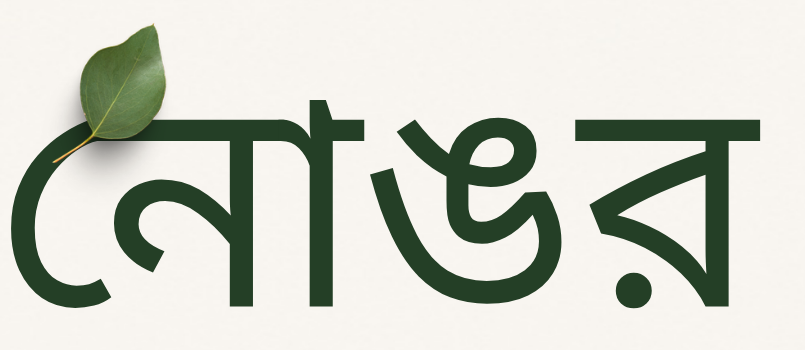
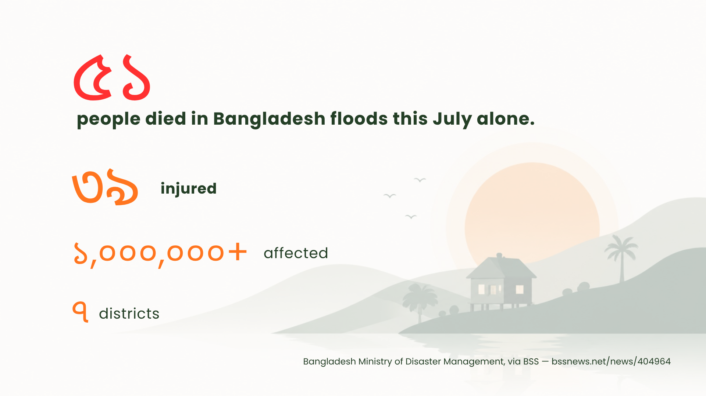
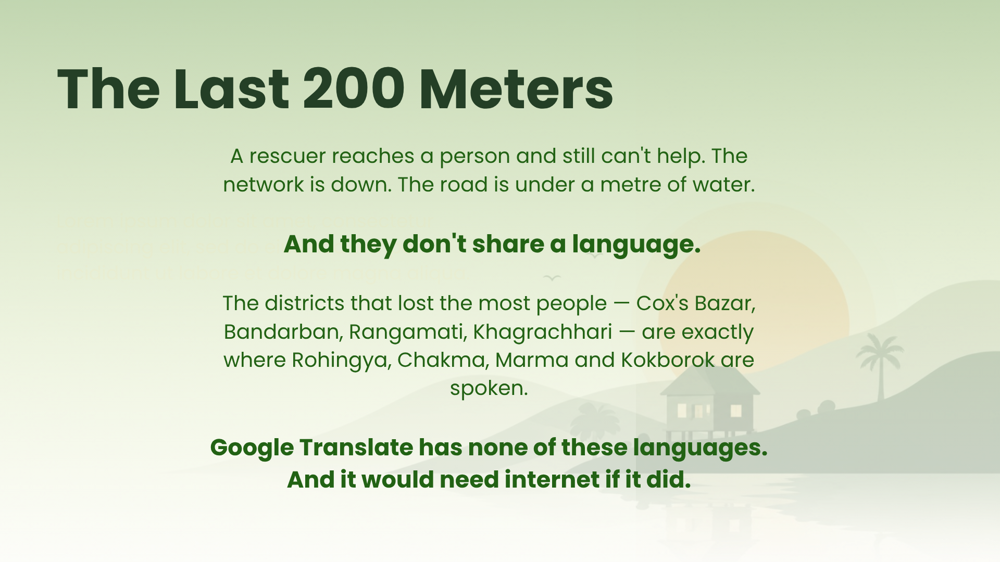
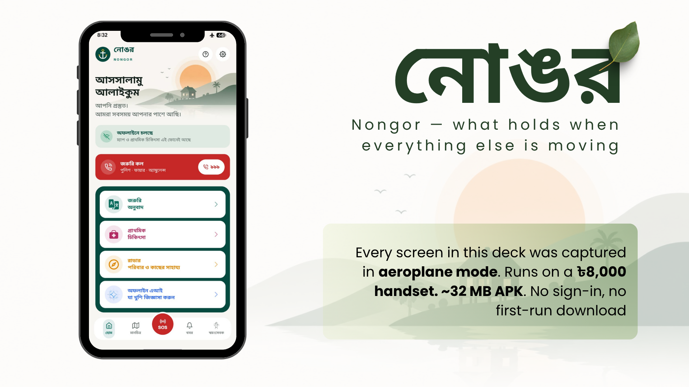
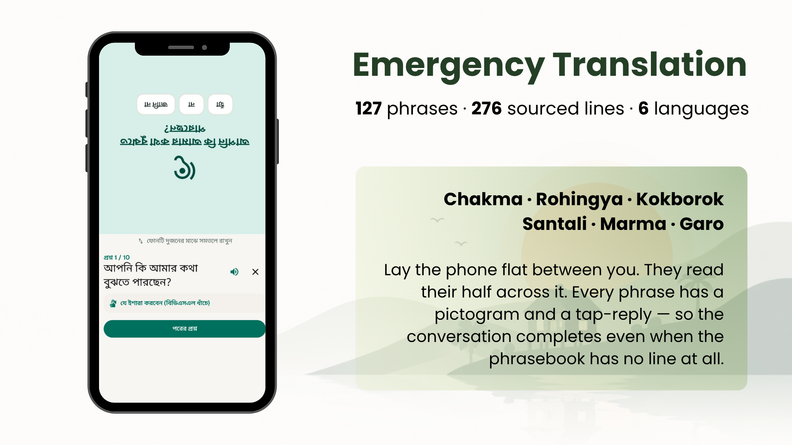
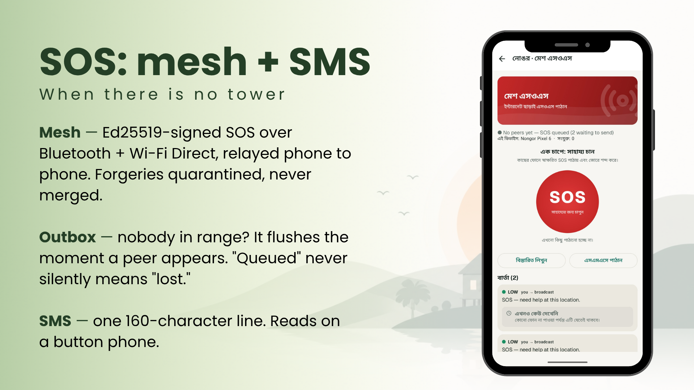
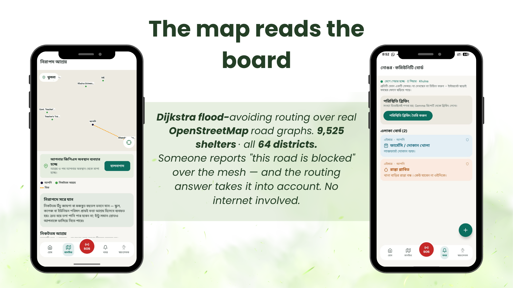
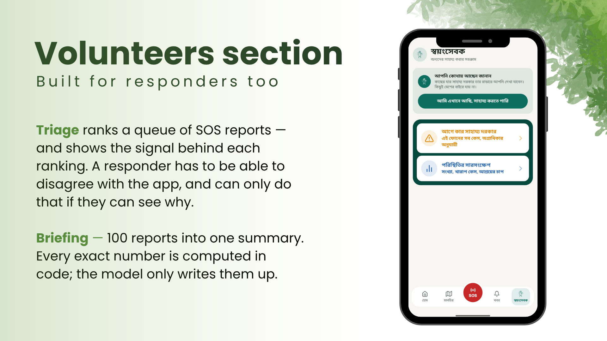
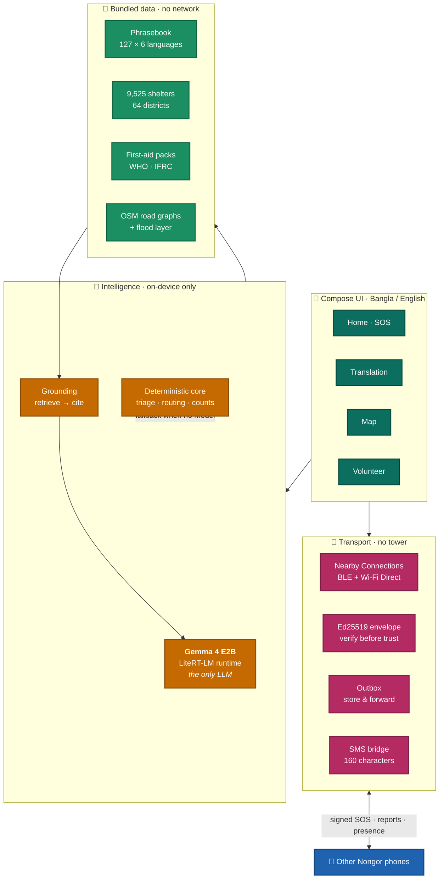
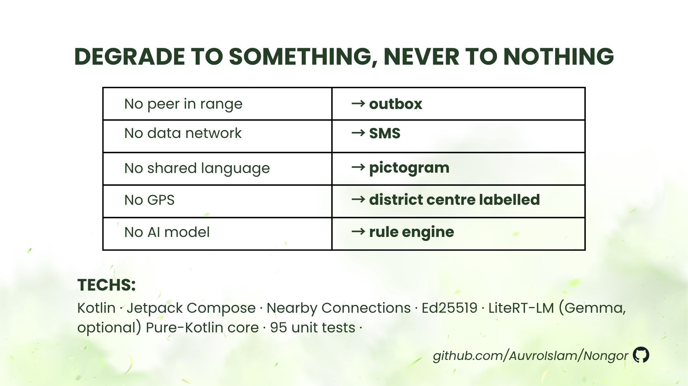

<div align="center">



### An offline crisis companion for Bangladesh

**No internet. No account. No server. No signal required.**

[](LICENSE)
[](#build-and-run)
[](#tech-stack)
[](#how-gemma-4-is-used)
[](#tests)

*Nongor (নোঙর) means **anchor** — what holds when everything else is moving.*

</div>

---

> **Nongor keeps flood victims and volunteers connected with no internet: signed phone-to-phone
> SOS, offline shelter maps, first aid and triage, AI on-device.**

---

<div align="center">

### ▶ Watch the demo

[](https://youtu.be/9GsZ_ATN0ZQ)

**[youtu.be/9GsZ_ATN0ZQ](https://youtu.be/9GsZ_ATN0ZQ)** · 3 minutes · recorded in aeroplane mode

</div>

---

## Why this exists



Those are the confirmed figures from Bangladesh's Ministry of Disaster Management for **July 2026
alone** ([BSS](https://www.bssnews.net/news/404964)). Cox's Bazar lost 28 people, Chattogram 13,
Bandarban 6, Rangamati 3, Moulvibazar 1.

Bangladesh's disaster response is not short of helicopters or volunteers. The gap is the
**last two hundred metres** — where a rescuer physically reaches a person and still cannot help.



Read that casualty list against a language map. The districts that lost the most people —
**Cox's Bazar, Bandarban, Rangamati, Khagrachhari** — are precisely where Rohingya, Chakma, Marma
and Kokborok are spoken. Cox's Bazar alone holds the world's largest Rohingya settlement.

A volunteer from Dhaka reaches a family there and cannot ask *"are you hurt?"*. Google Translate
carries none of those languages, and would need a tower if it did.

That is the shape of the problem Nongor is built around.

---

## What it does



**Every screenshot in this README was captured in aeroplane mode**, on a ৳8,000 handset. That is
the design constraint, not a marketing line.

### Emergency Translation



No offline translator covers these languages, so Nongor does not pretend to be one. It ships a
fixed set of the questions that matter in a rescue — **127 phrases, 276 sourced translation lines,
six languages** — and makes the conversation completable even where the phrasebook is silent.

| | Chakma | Rohingya | Kokborok | Santali | Marma | Garo |
| --- | ---: | ---: | ---: | ---: | ---: | ---: |
| sourced lines | 51 | 50 | 50 | 50 | 39 | 36 |

The hand-over card is split down the middle and the top half is drawn **upside down**: lay the
phone flat between you and the other person reads their half across it. Every phrase carries a
pictogram and a tap-reply — Yes / No / Don't know, a number pad, a 1–5 pain scale, a body-part
list — so the exchange completes **even when there is no line at all** for that language. That is
the real innovation: the fallback is not a worse translation, it is a protocol that needs no
shared language.

Ten guided questions build a structured hand-over note — bleeding: yes, breathing: no, four
people, one child — triaged by the same engine as the rest of the app and sendable straight over
the mesh. A volunteer who speaks no Chakma still walks away holding a medical record.

> **On the minority-language lines.** Bangla and English are authored. Everything else is either
> drawn from a published corpus ([MELD](https://data.mendeley.com/datasets/dy5dyfygbp/4),
> [GATITOS](https://github.com/google-research/url-nlp/tree/main/gatitos), both CC BY 4.0) and
> shown with the English sentence it was actually translated from, or marked
> **যাচাই হয়নি · unverified** every single time it appears. Neither is presented as verified, and
> the pictogram protocol never depends on either. Details in
> [`docs/PHRASEBOOK.md`](docs/PHRASEBOOK.md).
>
> **Gemma is never used to translate these languages.** It has almost no training data for them
> and would produce fluent, confident, wrong output — the one failure mode a rescue phrasebook
> cannot have. Where the model is installed it does one narrow job: reading a free-text
> description and picking which *existing* phrases to show. It selects ids; it never writes a word
> of any language, and a hallucinated id is discarded.

### SOS — mesh, then SMS



Hold the button and the phone sounds a siren *and* pushes an **Ed25519-signed** SOS to every
Nongor phone in Bluetooth / Wi-Fi Direct range, relayed onward hop by hop. Forged envelopes are
quarantined, never merged into the trusted set — a fake report must not be able to distort rescue
priority.

Nobody in range? It goes to an **outbox** and flushes the moment a peer appears; "queued" never
silently means "lost". No data network at all? The same SOS collapses into **one 160-character
SMS line** that reads on a button phone and can be pasted back into Nongor at the other end.

When someone actually opens your SOS, you find out — a signed read receipt travels back over the
same mesh. The screen is careful about what that means: *your message got through*, not *help is
coming*.

**And when it is over, you can say so.** "I am safe now" stops the alarm and pushes a signed
stand-down along the same relay, so every phone that heard the call learns it has ended. In a
flood the scarce resource is boats and people; a rescuer steering toward an SOS that was resolved
an hour ago is capacity taken from someone still waiting. Cancelling has to travel as far as the
call did.

Two details that matter. The stand-down is its own green button rather than a second meaning for
the red circle — someone shaking on a roof should not have to work out that "STOP" is the thing
that tells their family they are alright. And the call **stays on the log**, marked resolved,
rather than vanishing: a responder already moving needs to see it was stood down, because "it
disappeared" and "they are safe" are very different things.

### The map reads the board



**9,525 shelters across all 64 districts**, with flood-avoiding pedestrian routing (Dijkstra over
real OpenStreetMap road graphs) in the detailed packs.

The part that makes it more than a map: a neighbour posts *"this road is blocked"* to the community
board over the mesh, and the map assistant **takes that into account** when you ask for a safe
route. Local knowledge, minutes old, with no internet in the loop.

**And the neighbourhood can correct itself.** Every report carries **"I see it too"** and
**"Not what I see"**. Votes are signed and spread over the same mesh, and the counts reach Gemma
with the report — so the assistant can say *"four people nearby confirm this"*, or flag that a
claim is disputed more than it is confirmed and refuse to route you on it alone. One eyewitness
is a claim; five who walked past the same road is close to a fact, and five who say the road is
fine is a reason to doubt it.

Deliberately **not** a like button. A thumbs-up says how you feel; nobody's feelings should move
a rescue route. And votes are stored as sets of signed voter identities, not counters, so a vote
relayed over two hops cannot count twice and a single handset cannot manufacture a consensus to
bury a true report.

### Built for responders too



A volunteer with one boat and nine calls has one question: *who do I go to first?* Triage ranks the
queue **and shows the signal behind each ranking** — a responder has to be able to disagree with
the app, and can only do that if they can see why.

The briefing turns a hundred reports into one short summary. Every exact number is computed in
code; the model only writes them up.

### And the rest

| Feature | What it does when the network is gone |
| --- | --- |
| **Emergency call** | 999 plus the official BD short codes (1090 flood warning, 16111 Coast Guard, 333, 102, 109, 1098), bundled in the APK. Uses `ACTION_DIAL`, so it needs no call permission and never dials on its own. |
| **Radar** | Direction and distance to family, to people calling for help, and to volunteers offering it — no map needed. Family presence is hashed and encrypted, so strangers in range learn nothing. |
| **Community board** | Tag what you can see — road flooded, shelter full, pharmacy open — and it spreads phone to phone. |
| **Offline AI** | Free-form questions about the flood, entirely on the handset. |

---

## System architecture



Nothing in that diagram crosses the internet. The only network Nongor speaks is **phone to phone**.

---

## How Gemma 4 is used

**Gemma 4 E2B is the only large language model in this project.** No other LLM or generative
foundation model is used anywhere — not for a feature, not for a fallback, not behind an API. It
runs entirely on the handset through **LiteRT-LM**; no prompt, photo or location ever leaves the
device.

It is the reasoning layer behind six features:

| Feature | What Gemma 4 does | Grounded on |
| --- | --- | --- |
| **First Aid** | Turns "deep cut on the leg, bleeding a lot" into ordered, individually cited steps — and can read an attached photo of the injury | Retrieved WHO / IFRC / Red Cross passages |
| **Map assistant** | Answers "which way to the nearest shelter?" in natural language, **including neighbours' mesh reports** about blocked roads, weighted by how many people confirm or dispute each one | Shelter list, route result, community board + votes |
| **Triage** | Ranks a queue of SOS calls by urgency and states the risk signals behind each ranking | The report text and optional photo |
| **Situation briefing** | Writes a coordinator briefing from a hundred reports | Counts computed in code, never by the model |
| **Offline chat** | Free-form questions about the flood, safety, what to do next | Open, with safety framing |
| **Phrase finder** | Picks which fixed phrases fit what the volunteer describes | The 127-phrase book |

### Where the model is deliberately *not* trusted

This took the most work of anything in the project. An LLM that invents a shelter name or a
compression rate during a flood is worse than no LLM.

- **Numbers never pass through the model.** Counts, distances, coordinates and shelter capacities
  are computed in Kotlin and rendered directly. Gemma paraphrases them into prose; it never
  supplies them. That was not a theoretical worry — asked to summarise, it turned `500` into
  `50000`, and reported "455 blocked roads" when the engine had counted 455 *graph segments
  crossing a flood layer*, which is a far bigger claim than the data supports.
- **First aid is retrieval-grounded.** Steps must come from retrieved passages and carry their
  citation; the prompt forbids inventing a drug, dose or rate, and requires every number copied
  exactly.
- **Untrusted text is fenced.** User input, mesh reports and phrase notes are wrapped as data, not
  instructions, before reaching a prompt.
- **Neighbours' reports are attributed, not absorbed.** When the map assistant uses a community
  report it must say who reported it and how long ago, and may never restate it as confirmed fact.
- **Disagreement is surfaced, never hidden.** Where a report is disputed more than confirmed, the
  model is required to say so rather than quietly drop it or quietly repeat it.
- **The phrasebook is never AI-written**, as described above.

### What is lost without the model

Nongor still runs — but this is an honest account of the difference:

| Feature | With Gemma 4 | Without |
| --- | --- | --- |
| First Aid | Ordered steps for *your* situation, photo-aware | The source passages, unranked |
| Map assistant | Natural-language answer citing the board | Nearest shelter + route only |
| Triage | Reasoned ranking with stated signals | Keyword rule engine |
| Briefing | Written summary | Raw counts and bars |
| Offline chat | Available | Unavailable |

The deterministic core is a **safety net for ৳8,000 phones, not an equivalent**. It keeps the
life-critical paths — SOS, mesh, routing, phrasebook, siren — alive on hardware that cannot hold a
2.5 GB model. Everything that requires *understanding* is Gemma.

---

## What broke, and how we fixed it

The interesting failures were not the ones we designed for. These are the real ones, in the order
they cost us the most time.

### 1. Two phones on the same table would not pair

The worst bug we hit, because it silently disabled *three* features at once — mesh SOS,
community reports and family radar all ride the same transport.

Both phones advertised and discovered correctly. Neither ever connected. Nearby Connections has
both sides advertising *and* scanning, so if both call `requestConnection` on each other you get
two sockets for one pair — double-counted peers, every payload sent twice. Our fix was a tie-break:
only the lower advertised name dials.

That made the entire pairing depend on **one specific phone's discovery working**. When the
lower-named phone was the one whose BLE scan got throttled — routine on OEM Android — both phones
advertised at each other forever. `logcat` proved discovery was fine: we could see our own service
hash and the peer's endpoint name in the BLE advertisement the whole time.

Removing the tie-break made it worse. Both sides then dialled in the same instant, Nearby resolved
the collision by silently dropping one or both requests — **no failure callback fires** — and our
in-flight guard was never cleared, so every later discovery callback returned early. A permanent
stall.

**Fix:** both sides dial, but with 150–1800 ms of random jitter so one almost always gets there
first and the other receives an incoming connection instead; plus a 12-second watchdog that
releases the guard if a dial never resolves, so discovery retries instead of giving up forever. A
redundant socket is already handled — a second connection to a name we hold is dropped, and
payloads dedupe by message id — so a duplicate is a far cheaper failure than no connection.

### 2. Gemma inventing numbers

Asked to summarise the situation, the model turned a shelter capacity of `500` into `50000`, and
reported **"455 blocked roads"** when the engine had counted 455 *graph segments crossing a flood
layer* — a far bigger claim than the data supports.

**Fix:** numbers never pass through the model. Counts, distances, coordinates and capacities are
computed in Kotlin and rendered directly; Gemma only paraphrases them into prose. The briefing
screen keeps the two visually separate, and the exact per-case list and shelter bars are rendered
straight from the stats.

### 3. Radios that fail silently

"0 phones in range" means *nobody is nearby*. It also means *your Bluetooth is off* and *you
declined a permission*. Those lead to opposite decisions — the first says wait, the second says fix
something — and the app showed the same sentence for all three.

Worse, two screens that ride the mesh (Radar and the community board) **never requested the mesh
permissions at all**. Open the app on either one first, on a fresh install, and it advertised into
nothing forever without ever prompting. We only caught it by reading `dumpsys package` on a test
device and seeing all five permissions `granted=false` with no `USER_SET` flag — never even asked.

**Fix:** one shared permission list used by all three mesh screens, and a readiness check that
reports exactly what is blocking — Bluetooth off, Wi-Fi off, location services off, permission
missing — as a banner that opens the precise settings panel that fixes it. Where the state cannot
be read (adapter state needs `BLUETOOTH_CONNECT` on API 31+) it reports *unknown* rather than
guessing, because a wrong diagnosis sends someone to the wrong screen.

### 4. One person shouting became five emergencies

Holding the SOS button re-broadcasts every 30 seconds so a neighbour who walks past in four minutes
still receives it. Each re-broadcast minted a **fresh message id**, so one call for help landed in
the local store as five separate cases — and the coordinator briefing counted all five.

**Fix:** one id per press, reused for every repeat. Receivers dedupe on it, so a phone that already
holds the message ignores the repeat while a phone arriving on the fourth attempt still gets it —
which is what store-and-forward is for.

### 5. A read receipt that could get someone killed

We added read receipts so a person can tell their SOS reached a human. Then we had to be careful:
someone on a roof reading *"seen by 3"* can reasonably conclude three people are coming, stop
shouting, and wait.

**Fix:** the receipt fires when the message is actually **on screen**, not when it arrives — a
confirmation you can earn while the phone is in a pocket tells the sender nothing. And the wording
never oversells: *"Your message got through. That is not a promise that help is on the way — keep
trying other ways too."* Unverified envelopes are dropped, because a forged receipt is worse than
no receipt.

### 6. Gson quietly ignores Kotlin defaults

Gson populates fields reflectively without running the Kotlin constructor. A store file written by
an earlier build leaves a newly-added non-null field holding `null`, and the app crashes on first
read of a perfectly valid save file.

**Fix:** persisted models use nullable types with accessors that supply the default, and there is a
test that loads a store file written before the field existed.

### 7. A translation feature we measured, then deleted

When the phrasebook has no line for a language, the obvious idea is to compose one word-by-word
from the vocabulary we do have. We built the lexicon and measured coverage **before** writing the
feature.

The result killed it: GATITOS covers only three of our six languages, and its 50 English keys miss
almost every word the triage questions use. *"Where does it hurt? Point with your finger"* resolved
to **one word out of seven**. A word-by-word gloss is also not a sentence — presenting it as one
invites a volunteer to badly miscommunicate in a medical exchange.

**Fix:** we did not ship it. The pictogram-plus-tap-reply protocol already completes the
conversation without any words at all, which is a better answer than a confident-looking fragment.

---

## Degrade to something, never to nothing



| Failure | Nongor's answer |
| --- | --- |
| No peer in range | Outbox — flushes the moment one appears |
| No data network | SMS bridge, 160 characters, button-phone readable |
| No shared language | Pictogram + tap-reply |
| No GPS fix | Tap the map to place yourself; district centre labelled honestly |
| No AI model | Deterministic rule engine |
| A call for help that is over | "I am safe now" — a signed stand-down along the same relay |
| A report nobody else can see | Disputed on the board; the assistant stops routing on it |
| No internet, ever | The default assumption |

---

## Build and run

**Requirements** — JDK 17, Android SDK 35, and a device or emulator on Android 8.0 (API 26) or
newer. Two physical devices if you want to see the mesh.

```bash
git clone https://github.com/AuvroIslam/Nongor.git
cd Nongor/nongor-android

./gradlew assembleDebug        # build
./gradlew installDebug         # install on a connected device
./gradlew testDebugUnitTest    # run the 145 unit tests
```

The APK lands in `app/build/outputs/apk/debug/app-debug.apk`.

No API keys, no `local.properties` secrets, no backend to stand up. Gradle resolves everything;
`gradle/libs.versions.toml` is the single dependency manifest.

### Using it

1. **Launch.** Every feature except the AI works immediately — no sign-in, no first-run download.
2. **Optional: add Gemma 4.** Onboarding offers a ~2.5 GB model download (Wi-Fi recommended). Skip
   it and the app runs on the deterministic core; add it later from Settings.
3. **Two phones for the mesh.** Install on both, grant nearby-devices and location permission, and
   keep Bluetooth on. SOS, community reports and family presence flow between them with no network.
4. **Aeroplane mode.** Switch it on and keep using the app — that is the whole demo.

---

## Tech stack

| Layer | Choice |
| --- | --- |
| Language / UI | Kotlin 2.0, Jetpack Compose, Material 3 |
| On-device LLM | **Gemma 4 E2B** via LiteRT-LM — the only LLM |
| Mesh transport | Google Nearby Connections (BLE + Wi-Fi Direct), `P2P_CLUSTER` |
| Signing | Ed25519 via BouncyCastle, Lamport-clock dedup, TTL relay |
| Routing | Dijkstra over OpenStreetMap pedestrian graphs, flood-polygon avoidance |
| Storage | JSON stores on internal storage, SharedPreferences |
| Build | AGP 9.1, Gradle version catalog |

### Third-party components and data

| Component | Use | Licence |
| --- | --- | --- |
| [Gemma 4 E2B](https://deepmind.google/models/gemma/gemma-4/) | On-device LLM | Gemma Terms of Use |
| [LiteRT-LM](https://github.com/google-ai-edge/LiteRT-LM) | Model runtime | Apache-2.0 |
| Google Nearby Connections | Mesh transport | Play Services terms |
| BouncyCastle | Ed25519 signing | MIT |
| Feather Icons (compose-icons) | Iconography | MIT |
| [OpenStreetMap](https://www.openstreetmap.org/copyright) | Road graphs | ODbL |
| [MELD](https://data.mendeley.com/datasets/dy5dyfygbp/4) | Chakma / Marma / Garo lines | CC BY 4.0 |
| [GATITOS](https://github.com/google-research/url-nlp/tree/main/gatitos) | Six-language vocabulary | CC BY 4.0 |
| WHO / IFRC / Red Cross first-aid guidance | First-aid passages | Cited in-app, per step |

### AI assistance disclosure

**Claude (Anthropic) was used as a coding assistant** for implementation, refactoring and test
writing. Architecture and product decisions were made by the team, and changes were reviewed
before commit. The *application's own* intelligence is Gemma 4 exclusively — no other model runs
inside the app or generated any of its shipped content.

---

## Data and privacy

Nongor has no server, no account and no analytics. Nothing is uploaded, because there is nowhere
to upload to.

| Data | Why it is collected | Where it goes |
| --- | --- | --- |
| Your SOS text and position | So a rescuer can find you | Signed, broadcast to nearby Nongor phones only |
| Community reports | Warn neighbours about roads and shelters | Same mesh, same signing |
| Family code and name | Recognise relatives over the mesh | Never broadcast in the clear — the code is **hashed**, the name **AES-GCM encrypted**; a stranger in range learns nothing |
| Location | Distances, routing, attaching a position to an SOS | Stays on the phone unless you send an SOS or report |
| Photos and prompts | First aid and triage | Never leave the device — the model is local |

Permissions requested: location and nearby-devices (mesh discovery), microphone (voice input),
camera and photos (injury assessment). All are optional; declining one degrades that feature alone.

Nongor is not a surveillance tool, and could not be repurposed as one — there is no central view of
anything, anywhere.

---

## Tests

```bash
./gradlew testDebugUnitTest
```

**166 unit tests**, concentrated where being wrong is expensive: Ed25519 envelope verification and
forgery rejection, mesh dedup and multi-hop relay, the family-presence crypto handshake, SOS read
receipts and stand-downs surviving a restart, report votes refusing to double-count a relayed
duplicate, triage rules, flood-avoiding routing, what the briefing is allowed to claim about
roads, SMS encode/decode round-trips, and phrasebook asset integrity.

The core logic is deliberately pure Kotlin with no Android dependencies, so it runs on the JVM
without a device.

---

## Repository layout

```
nongor-android/app/src/main/java/org/nongor/app/
  core/          pure Kotlin — mesh envelope, crypto, routing, triage, SMS, phrasebook
  mesh/          Nearby Connections transport, outbox, identity, readiness checks
  inference/     Gemma 4 / LiteRT-LM engine holder
  data/          repositories and bundled-asset loaders
  ui/            Compose screens
nongor-android/app/src/main/assets/
  phrasebook.json        127 phrases × 6 languages
  bd_shelters.json       9,525 shelters
  first_aid_packs.json   WHO / IFRC passages
docs/PHRASEBOOK.md       how each translation line was sourced
```

---

<div align="center">


Licensed under the [MIT License](LICENSE).

*If Nongor is useful to you, a ⭐ helps it reach the people who need it.*

</div>
